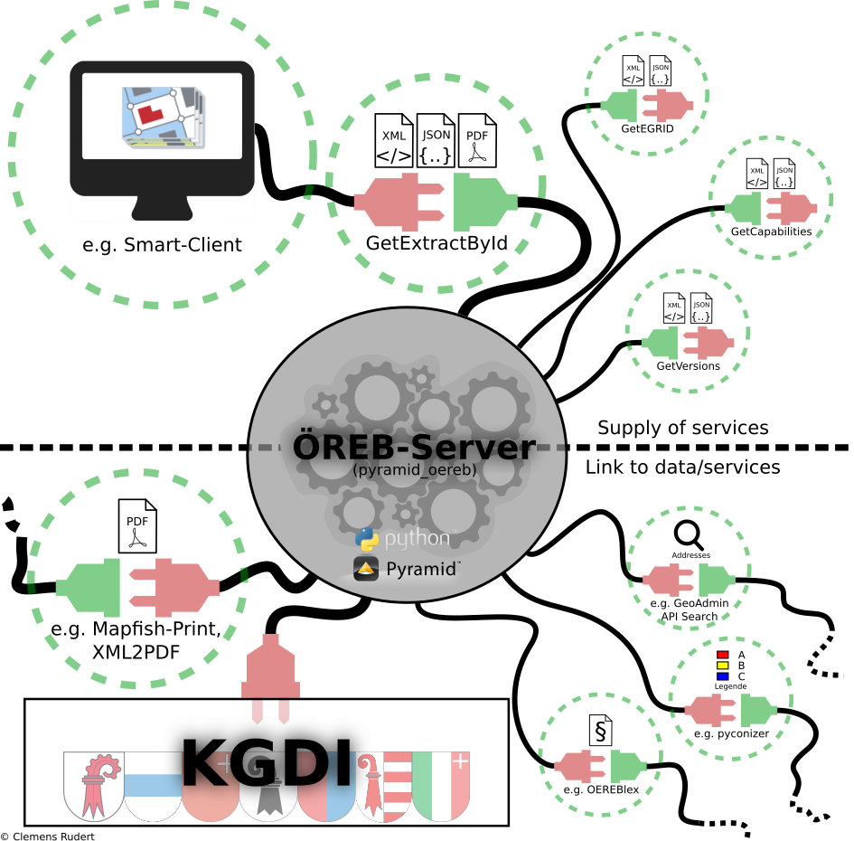

:css: css/main.css
:slide-numbers: true
:skip-help: true

.. title:: pyramid_oereb DEV Workshop

.. header::

   .. image:: images/open_oereb.png
        :height: 128px
        :width: 128px

.. footer::

    **pyramid_oereb DEV Workshop**, Clemens Rudert, Rudert Geoinformatik 2021

----

pyramid_oereb DEV Workshop
==========================

----

.. image:: images/plugboard.jpg
    :height: 512px
    :width: 512px

----

pyramid_oereb nutzt `GNU Make <https://www.gnu.org/software/make/>`_ zur Automatisierung
========================================================================================

Was gehört dazu?

* `./Makefile <https://github.com/openoereb/pyramid_oereb/blob/master/Makefile>`_
* `./Makefile_windows <https://github.com/openoereb/pyramid_oereb/blob/master/Makefile_windows>`_

Wichtige Befehle:

.. code::

    make install

.. code::

    make lint

.. code::

    make tests

.. code::

    make serve

.. code::

    make doc

.. code::

    make clean-all

----

pyramid_oereb nutzt `GitHub <https://github.com/openoereb/pyramid_oereb>`_ / `GIT <https://www.git-scm.com/doc>`_
=================================================================================================================

Was gehört dazu?

* `./.gitattributes <https://github.com/openoereb/pyramid_oereb/blob/master/.gitattributes>`_ (`<https://www.git-scm.com/docs/gitattributes>`_)
* `./.gitignore <https://github.com/openoereb/pyramid_oereb/blob/master/.gitignore>`_ (`<https://git-scm.com/docs/gitignore>`_)
* `./.github/workflows/... <https://github.com/openoereb/pyramid_oereb/tree/master/.github/workflows>`_

Was macht GitHub (bei jedem Push und jedem PullRequest)

* Tests
* Docs
* Deploy zu PyPi

----

pyramid_oereb ist Python Package
================================

* `Installieren <https://packaging.python.org/tutorials/installing-packages/>`_
* `Erstellen <https://packaging.python.org/tutorials/packaging-projects/>`_

Was gehört dazu?
* `./setup.py <https://github.com/openoereb/pyramid_oereb/blob/master/setup.py>`_
* `./setup.cfg <https://github.com/openoereb/pyramid_oereb/blob/master/setup.cfg>`_
* `./requirements.txt <https://github.com/openoereb/pyramid_oereb/blob/master/requirements.txt>`_ / `./requirements-windows.txt <https://github.com/openoereb/pyramid_oereb/blob/master/requirements-windows.txt>`_ und evtl. requirements für Tests
* `./README.rst <https://github.com/openoereb/pyramid_oereb/blob/master/README.rst>`_ + `./CHANGES.rst <https://github.com/openoereb/pyramid_oereb/blob/master/CHANGES.rst>`_
* `./MANIFEST.in <https://github.com/openoereb/pyramid_oereb/blob/master/MANIFEST.in>`_
* Veröffentlichung auf `PyPi.org <https://pypi.org/project/pyramid-oereb/>`_

Auflistung in als Package Requirement:

.. code:: python

    pyramid_oereb==1.8.0

oder manuelle Installation via `PIP <https://pip.pypa.io/en/stable/>`_:

.. code::

    python3 -m pip install pyramid_oereb==1.8.0

nutzen das Python Package

----

pyramid_oereb ist ein `pyramid <https://docs.pylonsproject.org/projects/pyramid/en/2.0-branch/>`_ Plugin
========================================================================================================

Was gehört dazu?

* `./production.ini <https://github.com/openoereb/pyramid_oereb/blob/master/production.ini>`_
* `./pyramid_oereb/__init__.py <https://github.com/openoereb/pyramid_oereb/blob/master/pyramid_oereb/__init__.py>`_
* `./pyramid_oereb/views/webservice.py <https://github.com/openoereb/pyramid_oereb/blob/master/pyramid_oereb/views/webservice.py>`_
* `./pyramid_oereb/routes.py <https://github.com/openoereb/pyramid_oereb/blob/master/pyramid_oereb/routes.py>`_
* `./pyramid_oereb/lib/renderer/... <https://github.com/openoereb/pyramid_oereb/tree/master/pyramid_oereb/lib/renderer>`_

Webdienste:

* `GetVersions <https://geoview.bl.ch/main/oereb/versions.json>`_
* `GetCapabilities <https://geoview.bl.ch/main/oereb/capabilities.json>`_
* `GetEgrid <https://geoview.bl.ch/main/oereb/getegrid/json/?XY=2611445.9953929284,1260255.893990759>`_
* `GetExtractById <https://geoview.bl.ch/main/oereb/extract/reduced/json/geometry/CH914907827837>`_

Zusatzwebdienste:

* Logos `Kanton <https://geoview.bl.ch/main/oereb/image/logo/canton>`_ / `ÖREB <https://geoview.bl.ch/main/oereb/logos/logo_oereb_small.png>`_ etc.
* `Gemeindewappen <https://geoview.bl.ch/main/oereb/image/municipality/2773>`_
* `Legendensymbole <https://geoview.bl.ch/main/oereb/image/symbol/LandUsePlans/1/104306>`_ 
* `SLD <https://geoview.bl.ch/main/oereb/sld>`_ für Print

----

Es könnte so einfach sein ABER Anpassbarkeit macht Komplexität nötig
========================================================================

----

Uncle Bobs SOLID principles
===========================

* `Video <https://www.youtube.com/watch?v=zHiWqnTWsn4>`_ & `Beschreibung <https://www.digitalocean.com/community/conceptual_articles/s-o-l-i-d-the-first-five-principles-of-object-oriented-design>`_
* Separation von Core und Umsystemen
* Nutzung von Interfaces
* Wann immer möglich Dependency Inversion
* Umsetzung in pyramid_oereb nicht annähernd komplett aber immerhin...

----

Resultierender Aufbau
=====================

.. image:: images/base_architecture.png
    :height: 600px

----

Detail
======

.. image:: images/base_architecture.png
    :height: 600px

